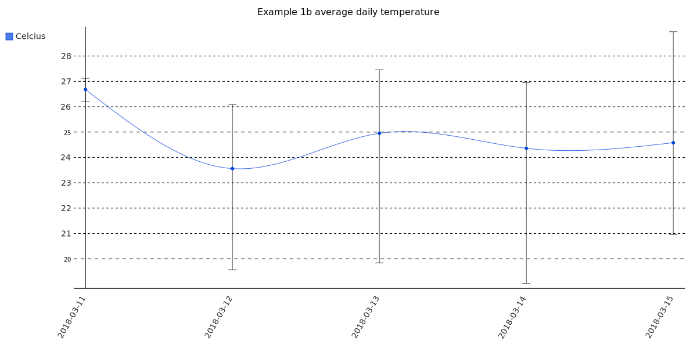

# csvchart
python script that converts CSV files into SVG images


Requires python's builtin `csv` module and the `pygal` module.

Turns one or more CSV files into SVG image charts. Can concatenate multiple CSV files into one logical database, from which it can chart multiple values as different charted lines. Exposes a fair amount of the [PyGal](https://www.pygal.org) functionality. although documentation of such is terrible.

## Examples

#### [Example 1](examples/ex1) Chart temperature and humidity from one logical data base, contained in five CSV files.

The start of `log1.csv` looks like this:
```
date,time,tempC,tempF,pressurePA,presureMB,light,R,G,B,heading,magnetometer0,magnetometer1,magnetometer2,accelX,accelY,accelZ,anal0,anal1,anal2,anal3,leds
2018-03-11,18:18,26.91,80.44,98553.97,985.54,61,104,112,125,336.97,2089,-1203,-5017,-0.01,0.05,1.0,0.561,0.543,0.549,0.585,OFF
2018-03-11,18:35,27.12,80.81,98580.4,985.8,245,106,83,94,336.57,2098,-1197,-4989,-0.01,0.05,1.0,0.516,0.57,0.582,0.555,ON
2018-03-11,19:05,26.77,80.18,98598.58,985.99,396,165,133,137,335.08,2100,-1212,-4998,-0.0,0.05,0.99,0.549,0.558,0.537,0.612,ON
```

`log2.csv`, `log3.csv`, etc have the same fields, and all files have disjoint data (no overlaps--they represent five days worth of readings).

##### Example 1a
We can create a chart of the temperature using this command:

```
csvchart.py \
"csv:file=log1.csv,log2.csv,log3.csv,log4.csv,log5.csv;x-field=date,time;y-fields=tempC;labels=Celcius" \
"chart:file=example1a.svg;title=Example 1a temperature readings;interpolation=cubic;"
```

Note the structure of this command, The `csvchart.py` command takes two (or more) arguments. The first is a "csv:..." argument, and it specifies the data source or sources. The rest of this argument are key/value pairs seperated by semicolons. The values may be lists, which are separted by commas. There's plenty to say here, but the most salient comments are that the `file=` key accepts a list of CSV files that needs to have disjoint data ranges. The `x-field=` will be interepretted as the single X-axis variable, and the value(s) come from the CSV file. It can be multiple values, which will be concatenated together before being added to the chart. This allows you to use CSV records where the `date` and `time` are seperate fields. Whereas the `y-fields` values can also be a list, but each value will be charted separately (e.g. temperature vs humidity). If you have multiple y-fields, you can have multiple labels, just keep then in the same order.

The second argument is the "chart:..." argument. It specifies how the resulting SVG chart looks. In this argument, most of the values are singletons, not list. For example, the `file=` key/value will specify the single SVG output file. Note that the [chosen interpolation](https://www.pygal.org/en/3.0.0/documentation/configuration/interpolations.html) can be very misleading. Right now, `csvchart` lets you choose any of the interpolation systels, but does not yet expose further attributes like `interpolation_parameters` or `interpolation_precision`.

The result of the above command on the example 1 data looks like [](examples/ex1/example1a.svg).

##### Example 1b
Here's a different version of the above command. It will display an average of each day's temperatures, and will also draw in the min and max temperatures (drawn as [confidence intervals](https://www.pygal.org/en/3.0.0/documentation/configuration/value.html?highlight=confidence#confidence-intervals) )

```
csvchart.py \
"csv:file=log1.csv,log2.csv,log3.csv,log4.csv,log5.csv;x-field=date;y-fields=tempC;labels=Celcius" \
"chart:file=example1b.svg;title=Example 1b average daily temperature;interpolation=cubic;include_x_axis=True;value=confidence"
```
Which results in [](examples/ex1/example1b.svg).

Note that instead of `x-field=date,time`, this new command only has `x-field=date` in the "csv:..." argument. Since there are multiple records with the same `date`, by default, only the last record of that day would get charted. But by adding `value=confidence` to the "chart:..." argument, all the values for that day will be averaged, and then confidence intervals based on the minimum and maximum for that day. Other `value=` values are `min`, `max`, `mean`, `first`, and `last`.  A `value=` of `maxconfidence` graphs the maximum value for the day, while still showing the min/max confidence interval. LIkeways `minconfidence`.

If this is confusing, consider that the behaviour of `value=` in the "chart:..." argument has an aggregation effect that's similar to [GROUP BY](https://www.w3schools.com/sql/sql_groupby.asp) in SQL SELECT statements. Noo doubht you are no longer confused.

This example also adds `include_x_axis=True` to the "chart:..." argument. This causes the chart to draw the Y scale all the way down to the X axis, which helps make this chart easier to understand, otherwise the confidence intervals get drawn off the bottom of the graph (because PyGal doesn't consider the confidence intervals when computing the automatic scaling range for the Y axis). This is due to the nature of this particular example data set, but a good reminder that some amount of dinking is usually needed to make the charts intelligible

#### [Example 2](examples/ex2) Chart temperature and humidity from three logical data bases, contained across fifteen different CSV files.

TODO
